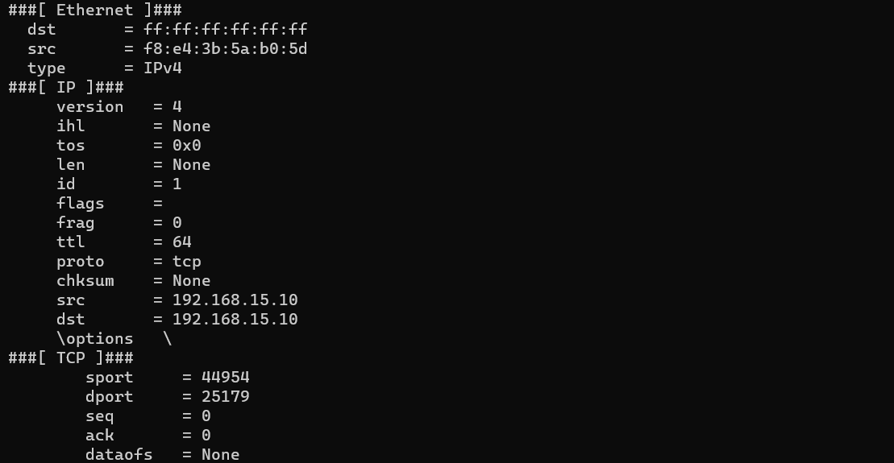

# Abnormal

#### 介绍

Abnormal是一个数据包构造工具，能够实现常见的异常包攻击。通过模块化的方式使构造数据包的格式进一步简化，无需熟悉各种异常包的构造原理，只需要了解需要发包的网卡和需要攻击的目标即可，极大的简化了测试工作者的学习成本。

**对比同类数据包构造工具：**

* **科莱数据包生成器：** Windows上十分开放的数据包编辑器，号称”数据包的基因编辑器“，能够通过内部自带的数据包模板进行高度自由的编辑。定义后的数据包直接选择网卡发送，也可导出保存。带有十分友好的UI界面，能够直观的观察到数据包的内部结构。但同时也存在的问题就是，对于大批量的不同数据包，手工成本过高。对于部分应用层协议也无法达到随心所欲的编辑、数据包模板种类过少。
* **hping3：** Kali上自带的十分优秀的TCP/IP协议数据包分析工具，主要用于防火墙测试、安全审计等。能够对网络层和传输层数据包进行高度自定义，同时包含了多种协议。但是由于是命令行工具，用户交互对比科莱欠缺一点，无法直观的观察到构造的数据包内容，需要十分明确需要构造的数据包结构，有较高的学习成本。其次hping3无法构造数据链路层数据包，对于部分攻击无法隐藏自己的源MAC，容易被安全审计软件追踪。
* **Abnormal：** 通过以上两个工具取长补短，工具体量小，能够直接在Windows上运行，无需额外安装各种Python第三方库。对于常见的异常包能够直接通过相关模块自动构造，只需确定发包网卡和目标靶机地址即可，学习成本小。对于部分异常包模块无法满足的情况，也可进入自定义模块来构造数据包。但对于Linux版本支持还不太友好，需要手动部署代码。同时由于是命令行工具，对于用户交互不太友好。

#### 软件声明

**中华人民共和国刑法（第285、286条）**

* **第二百八十五条**
* 违反国家规定，侵入国家事务、国防建设、尖端科学技术领域的计算机信息系统的，处三年以下有期徒刑或者拘役。
* **第二百八十六条**
* 违反国家规定，对计算机信息系统功能进行删除、修改、增加、干扰，造成计算机信息系统不能正常运行，后果严重的，处五年以下有期徒刑或者拘役；后果特别严重的，处五年以上有期徒刑。
* 违反国家规定，对计算机信息系统中存储、处理或者传输的数据和应用程序进行删除、修改、增加的操作，后果严重的，依照前款的规定处罚。
* 故意制作、传播计算机病毒等破坏程序，影响计算机系统正常运行，后果严重的，依照第一款的规定处罚。
* **本工具仅供学习、以及内部经授权的网络压力测试。禁止做任何违法的事情，任何后果与作者无关。**

#### 软件架构

* 软件主要采用Python 3.8.10进行编写
* 数据包构造方案主要采用scapy库
* 工具共可自动构造11种异常攻击数据包，同时也可自定义构造数据包。

#### 安装教程

**Windows**

* 使用前需要安装Npcap或WinPcap（建议使用最新Npcap），工具依赖此程序进行识别网卡、发送和抓取数据包。
  * Npcap：https://npcap.com/
  * WinPcap：https://www.winpcap.org/
* 进入项目`venv/src/dist`目录下，下载abnormal.exe文件即可，此方式无需安装Python环境和相关Python依赖库。

**Linux**

* 克隆项目至本地

  ```bash
  git clone https://gitee.com/taknife/Abnormal.git
  ```

* 安装Python解释器，版本为3.8.10，注意安装过程中需要将路径加入环境变量

* 进入到项目`venv/src`目录下，安装项目需要Python依赖库

  ```bash
  cd ./Abnormal/venv/src
  pip install -r requirements.txt
  ```

  此处可使用国内源进行安装

* 修改Python主文件首行注释`vim main.py`，删除第一行的第一个注释符`#`，修改后结果如下

  ```bash
  # 修改前
  # #!/usr/bin/env python
  # 修改后
  #!/usr/bin/env python
  ```

* 为主文件赋予可执行权限

  ```bash
  chmod +x main.py
  ```

* 测试代码是否可以正常运行

  ```bash
  main.py -h
  main.py --inter
  ```

  若可看到帮助信息，且能够成功识别网卡信息，证明工具正常执行

  **帮助信息：**

  

  **网卡信息：**

  

* 创建软链接快捷方式至`/usr/bin`

  ```bash
  ln -s main.py /usr/bin/abnormal
  ```

* 测试查看工具帮助和网卡信息是否正常

  ```bash
  abnormal -h
  abnormal --inter
  ```

#### 使用说明

**工作模式**

* 工具共分为两种模式，分别为主解析器和子解析器。
  * 主解析器：可查看设备网卡信息、路由信息（IPv4和IPv6）、工具版本信息。
  * 子解析器：又分为land-base、tcp-flag等12个模块其中，可单独查看每个模块的帮助信息。

**快速上手**

* 此处以land-base异常包攻击为例，快速生成异常数据包（其他异常包生成同理）

* 运行方式：运行cmd，将abnormal.exe可执行文件拖入cmd命令行窗口。（注意：若以管理员运行cmd，则无法直接拖入，需要手动复制abnormal.exe文件路径）

* 首先查看工具帮助信息`-h/--help`，可以看到工具相关选项信息

  ```bash
  abnormal.exe -h
  ```

  

  主解析器选项简介：

  * `-h/--help`，查看主解析器帮助信息
  * `--inter`，查看本地设备网卡信息
  * `--route`，查看本地设备路由信息（IPv4 / IPv6）
  * `--version`，查看工具版本信息

* 查看设备网卡信息`--inter`，选择发包网卡

  ```bash
  abnormal.exe --inter
  ```

  

  * Index：网卡索引
  * Name：网卡名
  * MAC：网卡MAC地址
  * IPv4：网卡配置的IPv4地址
  * IPv6：网卡配置的IPv6地址

* 确认所需要发包的网卡索引值，此处为12。

* 进入land-base模块，查看land-base解析器帮助信息

  ```bash
  abnormal.exe land-base -h
  ```

  

  注意：每个模块中均有两个必选选项，`-i`选择网卡（后面接网卡索引值），`-d`攻击目标主机的IP

* 根据帮助信息提示，向目标靶机发送攻击报文。

  ```bash
  abnormal.exe land-base -i 12 -d 192.168.15.10 -n 10
  ```

  此处`-n`是限制发送数据包的个数，限制发送10个数据包。可选项，若不填默认无限发送。

* 确认攻击后，工具会返回命令行已发送数据包的构造详细信息。

  

* 后面还会显示发包个数，以及告警信息。

  

  注意：此处告警主要是目标靶机在此环境中并不存在，因此找不到目标靶机的相关ARP和路由信息

* 攻击完成

#### 更新日志

* **[2022/10/17 11:30:00]** 已完成abnormal异常包攻击工具的框架以及主体部分，目前可自动构造4种攻击报文。分别为land-base、tcp-flag、winnuke、smurf。已推出第一个测试版本abnormal beta v1.0。
* **[2022/10/19 17:14:10]** 完成tear-drop模块，可自动构造tear-drop（泪滴攻击）报文。与其他解析器不同的是，此报文只发送一组，及两个数据包。推出第二个测试版本abnormal beta v1.1。
* **[2022/10/20 18:19:20]** 完成ip-option模块，可自动构造ip-option异常攻击报文，目前默认只能发送带有Record Route Option（记录路由选项）的ICMP报文，计划后续完成其他异常选项报文的构造。

